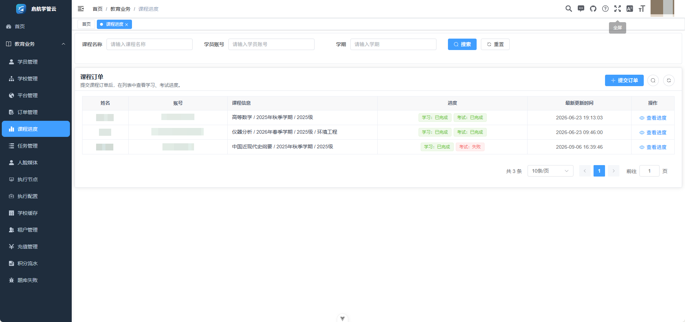

# 启航学管云

启航学管云是一个面向学生个人和教育机构的课程任务管理项目。用户可以在 Web 端维护学校和学习账号、提交课程订单，并查看课程、考试和任务进度。

项目使用 Vue 3 提供管理界面，FastAPI 负责用户、订单和业务数据，Go Worker 负责登录学校平台并执行课程任务。当前版本适合本地部署和共同研究学校平台适配，暂不建议直接部署为公开的多人在线服务。

## 界面



## 主要功能

- 管理个人用户、机构、学员、学校和平台资料。
- 支持机构租户管理，并可提交课程或考试订单。
- 通过 Go Worker 使用订单关联账号登录学校平台。
- 查看课程进度、考试进度、任务状态和脱敏日志。
- 管理执行节点、题库失败记录和本地人脸媒体文件。

目前已经打通订单提交、Go 登录、个人信息获取、进度回写和 Web 展示。平台接口会变化，不同学校的人脸、验证码和课程规则也不完全相同，这部分需要更多开发者和测试账号共同完善。

## 工作方式

```text
Vue Web
   |
FastAPI 业务后端 ---- MySQL / Redis
   |                       |
   +---- Go Worker --------+
              |
        第三方学校平台
```

Python 后端统一管理用户、机构、学员、学校和订单。Go Worker 从同一个数据库读取任务，执行平台登录、课程和考试流程，再写回进度与日志。两端共用数据库，但职责分开，学校协议不在 Python 中重复实现。

Go Worker 作为独立执行组件接入，本仓库不重复保存它的源码和构建产物。兼容版本基于 [yatori-go-console](https://github.com/yatori-dev/yatori-go-console) 扩展，维护在 [fendouweiqian/yatori-go-console](https://github.com/fendouweiqian/yatori-go-console)。

## 项目目录

| 目录        | 内容                   |
| ----------- | ---------------------- |
| `frontend/` | Vue 3 管理端           |
| `backend/`  | FastAPI 业务后端       |
| `database/` | MySQL 建表脚本         |
| `config/`   | Go Worker 集成配置示例 |
| `scripts/`  | Windows 启动和检查命令 |
| `docs/`     | 截图、来源和依赖说明   |

## 快速开始

需要准备 Python 3.11 或 3.12、Node.js 20、MySQL 8 和 Redis 7。执行真实课程任务还需要 Go Worker。

在仓库根目录创建数据库 `education_assistant`，再按顺序执行迁移：

```bash
mysql -u root -p -e "CREATE DATABASE education_assistant CHARACTER SET utf8mb4 COLLATE utf8mb4_unicode_ci;"
mysql -u root -p education_assistant -e "source database/migrations/0001_core_schema.sql;"
mysql -u root -p education_assistant -e "source database/migrations/0002_operational_domain.sql;"
mysql -u root -p education_assistant -e "source database/migrations/0003_seed_base_data.sql;"
```

第三个脚本写入默认租户、平台和学校目录。它不包含管理员、学生、订单、任务或任何登录凭证。不要使用包含真实学生、订单或任务数据的数据库备份初始化公开环境。

### Windows

在 PowerShell 中执行：

```powershell
py -3 -m venv backend\.venv
backend\.venv\Scripts\python.exe -m pip install -r backend\requirements-dev.txt
npm --prefix frontend ci

Copy-Item backend\.env.example backend\.env
Copy-Item frontend\.env.development.example frontend\.env.development
Copy-Item config\runner-integration.example.yaml config\runner-integration.yaml
```

修改 `backend/.env` 中的数据库、Redis 和认证配置。如果需要执行真实任务，再修改 `config/runner-integration.yaml`，然后启动服务：

```powershell
.\scripts\edctl.cmd service all start
.\scripts\edctl.cmd doctor
.\scripts\edctl.cmd browser
```

`edctl` 默认使用后端端口 `8281` 和前端端口 `5180`。运行 `.\scripts\edctl.cmd help` 可以查看状态、日志、重启和测试命令。

### Linux

```bash
python3 -m venv backend/.venv
backend/.venv/bin/python -m pip install -r backend/requirements-dev.txt
npm --prefix frontend ci

cp backend/.env.example backend/.env
cp frontend/.env.development.example frontend/.env.development
cp config/runner-integration.example.yaml config/runner-integration.yaml
```

修改配置后，分别启动后端和前端：

```bash
cd backend
.venv/bin/python -m uvicorn app.main:app --host 0.0.0.0 --port 8281
```

```bash
cd frontend
npm run dev
```

浏览器访问 `http://127.0.0.1:5180`。

## 配置 Go Worker

在项目根目录获取 Worker 源码并安装 Go 依赖：

```bash
git clone https://github.com/fendouweiqian/yatori-go-console.git runner/source
go -C runner/source mod download
go -C runner/source build -o ../yatori-go-console ./main.go
cp runner/source/config/runner.example.yaml runner/runner.yaml
```

Windows 构建时将输出文件改为 `../yatori-go-console.exe`，并同步修改下面的 `binary`。`runner/runner.yaml` 中的数据库必须与 Python 后端使用同一个库，`adminApi.baseUrl` 指向 Python 后端地址。

复制 `config/runner-integration.example.yaml` 后，主要填写以下字段：

- `enabled`：是否由 Python 后端启用 Go Worker。
- `binary`：Go Worker 可执行文件路径。
- `config`：Go Worker 自己使用的 YAML 配置路径。
- `internalUrl`：Go Worker 内部 HTTP 地址。
- `internalToken`：内部接口令牌，必须与 Go 配置中的 `internalHttp.token` 一致。

`binary` 和 `config` 使用相对于 `config/runner-integration.yaml` 的路径。运行配置已经加入 `.gitignore`，不要提交真实令牌、数据库连接或学生凭证。

## 首次登录

基础数据脚本会创建登录页所需的默认租户，但不会在公开仓库中放置通用管理员密码。首次登录信息约定如下：

| 项目           | 内容                                         |
| -------------- | -------------------------------------------- |
| 租户           | `000000`                                     |
| 超级管理员账号 | `admin`                                      |
| 超级管理员密码 | 由部署者在首次初始化时设置，仓库没有默认密码 |

先在 `backend/.env` 中为 `EDUCATION_AUTH_SECRET` 和 `EDUCATION_BOOTSTRAP_TOKEN` 分别填写随机值，再启动后端。随后调用一次初始化接口，把示例中的令牌和密码替换为自己的值：

```bash
curl -X POST http://127.0.0.1:8281/education/auth/bootstrap \
  -H "Content-Type: application/json" \
  -H "X-Bootstrap-Token: 替换为EDUCATION_BOOTSTRAP_TOKEN" \
  -d '{"tenantId":"000000","username":"admin","password":"替换为至少8位强密码","nickName":"超级管理员"}'
```

该接口只允许在 `ea_user` 为空时成功一次。创建完成后，在 Web 登录页填写租户 `000000`、账号 `admin` 和刚才设置的密码。随后应从 `backend/.env` 中删除 `EDUCATION_BOOTSTRAP_TOKEN` 并重启后端，避免初始化令牌继续有效。

## 参与贡献

学校平台经常调整登录和课程接口，维护者也很难准备所有学校的测试账号。欢迎提交新的学校适配、协议修复、Linux 启动脚本和可复现的错误信息。

提交代码前请阅读 [CONTRIBUTING.md](CONTRIBUTING.md)。报告问题时只提供平台名称、失败步骤和脱敏日志，不要在 Issue、PR 或 QQ 群中发送账号密码、Token、Cookie、学生信息、考试数据或数据库备份。安全问题请按 [SECURITY.md](SECURITY.md) 说明私下反馈。

QQ群：1107350553

## 使用须知

- 学生密码目前按现有数据库结构明文保存，只适合受控的本地环境。公开部署前必须增加凭证加密、轮换、访问审计和数据删除能力。
- 人脸识别和验证码是否出现由第三方平台决定，项目不能保证所有学校都能通过。
- 课程和考试任务按执行器规则自动执行与提交，目前没有人工确认步骤。
- 本项目不会伪造登录成功、课程完成或考试结果。账号错误或平台拒绝访问时，任务应返回失败。
- 项目源码仅限非商业学习、研究和本地验证，具体条款见 [LICENSE](LICENSE)。第三方组件继续遵守各自许可证。
